# School_District_Analysis
An analysis of Students' performance on standardized tests to reform school budgeting and priorities using Python, Pandas, and Jupyter Notebook.

## Project Background
The school board has been concerned about academic dishonesty in the students_complete.csv file that contains students scores; specifically, reading and math grades for Thomas High School ninth graders appear to have been altered.  

Although the school board does not know the full extent of the academic dishonesty, they want to uphold state-testing standards and haved requested to replace the math and reading scores for Thomas High School (THS) with NaNs while keeping the rest of the data intact. 

Once the data in question is replaced, The Board would like a repeat of the school district analysis and obtain a comparison of the results before and after the change. 

### Purpose
We intend to address the concerns of the school board members regarding questionnable scores. Thus, we will eliminated these scores from the dataset and repeat our analysis of the district schools in order to provide an accurate representation of the academic levels in the district. 

## Objectives
1. Replace ninth-grade reading and math scores
2. Repeat the school district analysis
3. Describe the change in analysis due to data alternation

## Resources
- Data Source: schools_complete.csv, students_complete.csv, clean_students_complete.csv
- Software: Anaconda (4.11.0), Python (3.7.6).
- Libraries and Packages: Pandas, NumPy, Jupyter notebook.
- Online Tools: [School District Analysis GitHub Repository](https://github.com/Magzzie/School_District_Analysis)

## Methods

1. Replacing questionable records with nulls:
  - Using the Pandas **loc** method with conditional statements and comparison and logical operators, we selected the ninth-grade reading and math scores for Thomas High School. 
  - Then, we used the Pandas NumPy module to change the reading and math scores to NaN.
  - Details are provided in the following code lines:  
    `student_data_df.loc[(student_data_df["school_name"] == "Thomas High School") & (student_data_df["grade"] == "9th"), "reading_score"] = np.nan`   
    `student_data_df.loc[(student_data_df["school_name"] == "Thomas High School") & (student_data_df["grade"] == "9th"), "math_score"] = np.nan`
  
2. Repeating the school district analysis with the adjusted student dataset:
    - First, we recreated the district summary by merging the altered student dataset with the original school dataset, then recalculating the total student count by subtracting the number of ninth-grade students in Thomas High School from the total student count. After that, we recalculated averages for reading and math scores in addition to the passing percentages for both subjects and the overall passing percentage with the recalculated student count.
  - Next, we recreated the school summary analysis by formatting the School Summary DataFrame, then updated the school summary using the 10th-12th graders from Thomas High School as follows:
    - First, we calculated the number of 10th-12th graders in Thomas High School.
    - Second, we created three new DataFrames for the 10th-12th graders from Thomas High School: students who passed math, students who passed reading, and students who passed both math and reading.
    - Next, we used these DataFrames mentioned above to recalculate the percentage of students who passed math, passed reading, and passed both math and reading for Thomas High School only.
    - Finally, we replaced the % Passing Math, % Passing Reading, and % Overall Passing scores in the current School Summary DataFrame with the new passing percentages for Thomas High School.

## Results
### Replace ninth-grade reading and math scores
- The School board members became aware of conerns regarding the integrity of ninth grade students' scores from Thomas High School.  
- We originally had 39,170 students's scores in our analysis. However, after removing 461 students who were the Thomas school ninth graders from the dataset, we ended up with 38,709 scores. 
- Here you can see the original scores in question:  
  
  ||
  |-|
  
- In response to their conerns, we have filtered the dataset for the reading and math scores of ninth graders in Thomas High School, and replaced them with nulls, as evident in the data frame screenshot:  
  
  ||
  |-|
 
### Repeat the School District Analysis
- We repeated the school district analysis and recreate all the district metrics using the new student dataset that skips ninth graders math and reading scores from Thomas High School. 
- We started with 15 schools and 39,170 students.
- The total budget for district schools: $ 24,649,428.
- Here's a comparison in reading and math scores before and after replacing THS 9th graders' scores with nulls:  
  
    |  | Average Reading Score | Average Math Score | 
    |---|---|---|
    | With Old THS 9th Scores | 81.87784018381414 | 78.98537145774827 |
    | With Null THS 9th Scores | 81.85579580976001 | 78.93053295099331 |
    
- The counts of students who passed reading and math had also changed after replacing THS 9th graders' scores with nulls.  

    |  | Passing Reading Count | Passing Math count  | 
    |---|---|---|
    | With Old THS 9th Scores | 33610 | 29370 |
    | With Null THS 9th Scores | 33158 | 28939 |

- The change in students count from Thomas High School also affected the schools passing percentages. 
    |  | Passing Reading % | Passing Math % | Overall Passing % |
    |---|---|---|---|
    | With Old THS 9th Scores | 85.80546336482001 | 74.9808526933878 | 65.17232575950983 |
    | With Null THS 9th Scores | 85.6596657108166 | 74.76039164018704 | 64.85571830840374 |

- Here you can see a comparison between the old district summary in the top snippet, and the new district summary at the bottom:  

  ||
  |-|
  ||

- Moreover, we recreated the school summary using the 10th-12th graders from thomas High School.
- The total number of Thomas High School students in 10th-12th grades was 1,174, down from 1,653 after removing 9th graders.
- We created three new data frames for THS students who passed math, reading, and both.  

  |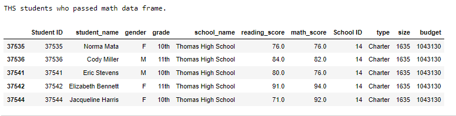|
  |-|
  |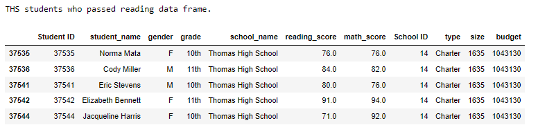|
  |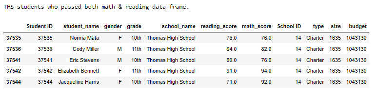|
  
- The number of THS students in 10th-12 grades who passed math: 1,094, reading: 1,139, and both: 1,064.
- The percentage of 10th-12th grade students passing math from Thomas High School was 93.19 %.
- The percentage of 10th-12th grade students passing reading from Thomas High School was 97.02 %.
- The overall passing percentage of 10th-12th grade students from Thomas High School was 90.63 %.
- Here you can see a comparison between the old school summary on top, and the new school summary at the bottom.  
  Please notice the difference in Thomas High School summary.  
   
  |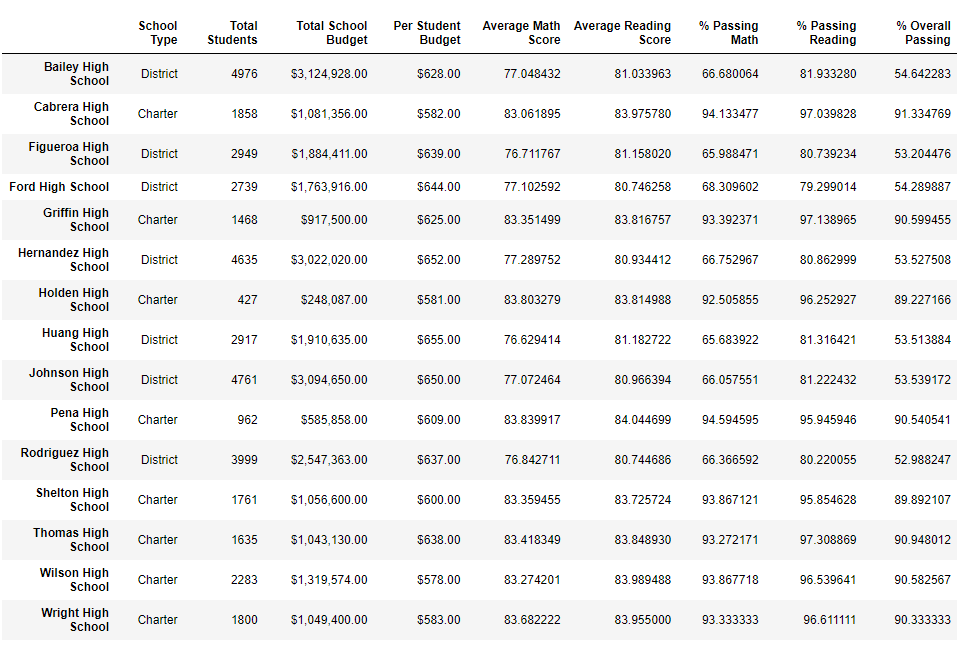|
  |-|
  ||
  
- Here you can see snippets of THS school summary before removing 9th graders bad scores on top, and after removing them and recalculating the school's summary from 10th-12th grades at the bottom.  
  
  |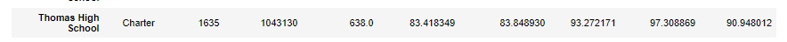|
  |-|
  ||
  
- The top 5 performing schools, based on the overall passing rate. Old ranking is on the top, and new ranking (after altering THS scores) at the bottom.  

  |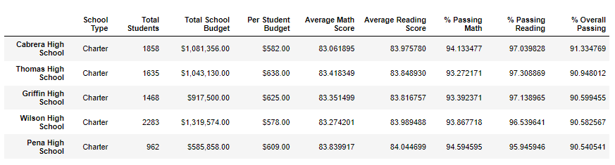|
  |-|
  |

- The bottom 5 performing schools, based on the overall passing rate from the altered data.  
  
  |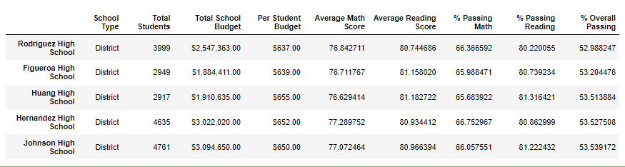|
  |-|  

- The average math score for each grade level from each school:  

  |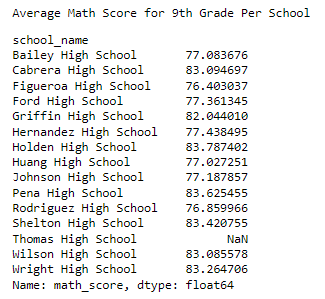|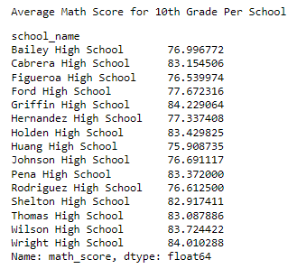|
  |-|-|
  |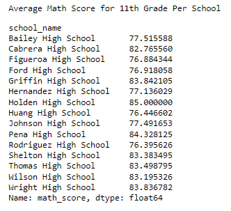|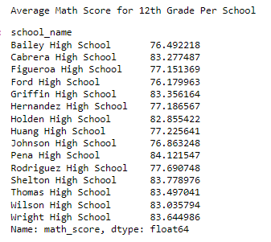| 
  
- The average reading score for each grade level from each school:  
  
  |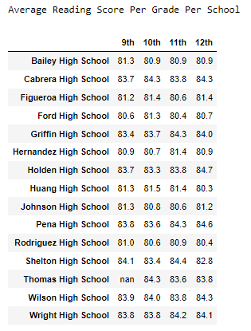|
  |-|

- The scores by school spending per student: 

  |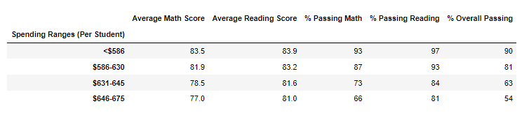|
  |-|
  
- The scores by school size:  

  |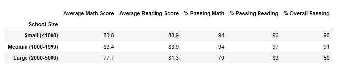|
  |-|
  
- The scores by school type:  

  |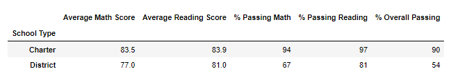|
  |-|

## Conclusions
- We removed the math and reading scores of 461 ninth grade students from the Thomas High School records.
- We did extensive comparison between scores prior to removing the altered 9th graders' math and reading scores from the Thomas High School records, and after as detailed through the above images. 
- Our findings were as follows: 
	- The passing percentages on the district level have decreased less than 1%. 
	- The passing percentages for each subject and over all for 10th-12th graders at THS ranged from 90.63% to 97.02%.
	- The average scores and passing percentages for each subject and over all for THS have decreased less than 0.5%.
	- Thomas High School was still the second top performing school in the district even after removing all 9th graders' scores. 
	- The difference in average scores and passing percentages when calculated per school size, school type and school spending per students were very insignificant. 
- Overall, Thomas High School maintained a high performance profile inspite of having less records in the dataset and did not affect the overall impression of district schools. 

---
